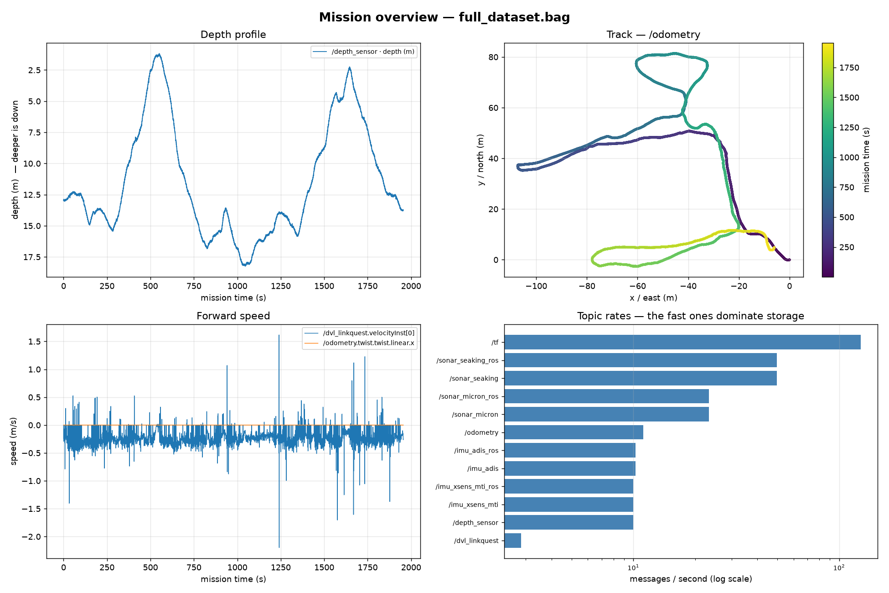

# Reading an AUV mission bag with plain Python

Two small tools for looking at what an underwater vehicle actually recorded — a **profiler**
that tells you what is in a bag, and a **plotter** that turns it into figures.

**No ROS installation required.** [`rosbags`](https://ternaris.gitlab.io/rosbags/) is pure
Python and reads both rosbag1 (`.bag`) and rosbag2 through one API. On a **377 MB,
661,327-message** bag, on an ordinary Windows laptop: **profiling takes about 1.5 s**, and
**profiling plus all three figures about 18 s** — most of that is rendering, not reading.

These back two write-ups:

- [Reading a real AUV mission recording](https://brucekrogman.com/reading-a-mission-bag) —
  the worked example, with the figures below and the data-quality traps
- [How an underwater robot writes things down](https://brucekrogman.com/ros2-data-patterns) —
  the structural patterns behind the format

## Install

```
python -m pip install -r requirements.txt
```

## Get a bag

The examples use the **Girona Underwater Caves** data set — an AUV running sonar and
navigation inside a flooded cave system. Download `full_dataset.bag` (376.9 MB) from
[Zenodo record 7828405](https://zenodo.org/records/7828405).

> **Citation is required if you publish anything derived from it:**
> Mallios, A.; Vidal, E.; Campos, R.; Carreras, M. "Underwater caves sonar data set,"
> *The International Journal of Robotics Research*, 2017, 36, 1247–1251.
> [doi:10.1177/0278364917732838](https://doi.org/10.1177/0278364917732838)

Any rosbag1 or rosbag2 file works — nothing here is specific to this vehicle.

## Use

```
python inspect_bag.py path/to/mission.bag                  # profile it
python inspect_bag.py path/to/mission.bag --peek /dvl      # dump real field values
python plot_bag.py    path/to/mission.bag --list           # what it can plot
python plot_bag.py    path/to/mission.bag --out figs/      # write figures
```

**`inspect_bag.py`** — duration, message count, and per-topic type / count / Hz / share of
total. `--peek` prints actual field values, so you can see what a custom vendor type contains
*before* writing analysis against it.

**`plot_bag.py`** — reads a bag into pandas and writes figures. Topics are matched by message
**type**, not name, so it runs unchanged on another vehicle's bag. `flatten()` turns nested
messages into dotted columns and *summarises* large arrays rather than exploding them — a
6,000-bin sonar scan becomes `.mean` and `.n`, not 6,000 columns.

## What the Girona bag turned out to contain

32.6 minutes, **661,327 messages, 12 topics**.

| topic | type | count | Hz |
|---|---|---|---|
| `/tf` | `tf2_msgs/TFMessage` | 249,131 | 127.4 |
| `/sonar_seaking` | `cirs_girona_cala_viuda/RangeImageBeam` | 97,501 | 49.9 |
| `/sonar_seaking_ros` | `sensor_msgs/LaserScan` | 97,501 | 49.9 |
| `/sonar_micron` | `.../RangeImageBeam` | 45,599 | 23.3 |
| `/sonar_micron_ros` | `sensor_msgs/LaserScan` | 45,599 | 23.3 |
| `/odometry` | `nav_msgs/Odometry` | 21,843 | 11.2 |
| `/imu_adis`, `/imu_adis_ros` | custom + `sensor_msgs/Imu` | 19,965 ea | 10.2 |
| `/imu_xsens_mti`, `/imu_xsens_mti_ros` | custom + `sensor_msgs/Imu` | 19,553 ea | 10.0 |
| `/depth_sensor` | `cirs_girona_cala_viuda/Depth` | 19,553 | 10.0 |
| `/dvl_linkquest` | `cirs_girona_cala_viuda/LinkquestDvl` | 5,564 | 2.9 |

Three structural things are visible immediately:

1. **Every sensor is published twice** — once as the vendor's custom type, once translated to
   a ROS standard type with identical counts (`/sonar_seaking` + `/sonar_seaking_ros`).
   Vendors do this so standard tooling works, at the cost of storing everything twice.
2. **Rates span 46×** on one vehicle. `/tf` alone is **37.7% of all messages**; the DVL is
   0.8%.
3. **The DVL has no standard message.** `LinkquestDvl` carries `velocityInst` *and*
   `velocityEarth` (both frames), `altitudeBeam[4]`, `bottomVelocityBeam[4]`, `dataGood[4]`,
   and a `rawData` string holding the original vendor ASCII sentence.

## Three ways the data will mislead you

All three parse cleanly and look plausible. None is a corrupt file.

- **`altitude = -2.0` is a no-bottom-lock sentinel**, not a measurement — 6 of 5,564 pings.
  Average the raw column and the answer is quietly wrong.
- **Only 86.2% of pings have all four DVL beams good** (per beam 94.9 / 97.8 / 95.5 / 98.0%).
  Per-beam altitude drops to exactly `0.0` on dropout — a second sentinel.
- **`/odometry` `twist.twist.linear.x` is all zeros.** Pose is populated; velocity never is.
  Speed has to come from the DVL. The field exists, is correctly typed, and is always zero.



Depth profile, dead-reckoned track coloured by time, forward speed, and per-topic message
rate on a log scale. `girona_figs/` also has IMU and DVL detail figures.

## Gotchas worth knowing

- **Git Bash mangles topic arguments.** `--peek /dvl_linkquest` becomes
  `C:/Program Files/Git/dvl_linkquest` under MSYS path conversion. Prefix with
  `MSYS_NO_PATHCONV=1`, or use PowerShell.
- **rosbag1 embeds its message definitions** in the bag's own connection headers, which is why
  the Girona bag's custom `cirs_girona_cala_viuda/*` types deserialize without their source
  packages.
- **Writing bags:** `rosbags.rosbag2.Writer` requires `version=8|9`, and deserialized messages
  are dataclasses exposing `__dataclass_fields__` with **no `__slots__`** — walking `__slots__`
  silently yields nothing.

## License

Not yet chosen — see the repo owner before reuse. The Girona data set is **not** redistributed
here and carries its own terms; fetch it from Zenodo and cite it as above.
